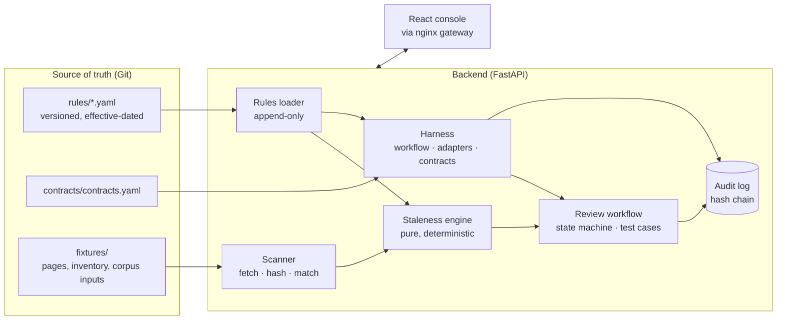

# Backstop

**Rules → contracts → evidence for AI workflows on a Medicare sales floor.**

Backstop keeps Medicare marketing rules as effective-dated YAML. It links each
rule version to the scripts, scorecard items, web pages and prompts that encode
it. It runs one AI workflow over a call corpus and checks every output with
contracts. When a rule, a prompt or a model changes, it shows what broke, who
owns the fix, and the evidence.

The worked example: CMS's CY2027 marketing changes take effect on
**October 1, 2026**, two weeks before the Annual Enrollment Period.

> Prototype built in about 48 hours for a conversation with Elite Insurance
> Partners (EIP). Not affiliated with or endorsed by EIP or any government
> agency. All call transcripts and internal artifacts are synthetic; public
> pages are real, frozen and attributed.

---

## Contents

- [At a glance](#at-a-glance)
- [Architecture](#architecture)
- [Results measured on real models](#results-measured-on-real-models-acts-45)
- [Mechanism demo (simulated)](#mechanism-demo--simulated--true-by-construction-acts-13)
- [What is real, simulated, not built](#what-is-real-what-is-simulated-what-is-not-built)
- [Questions a skeptical reviewer asks](#questions-a-skeptical-reviewer-asks)
- [Getting started](#getting-started)
- [Testing and quality gates](#testing-and-quality-gates)
- [Repository layout](#repository-layout)
- [Documentation](#documentation)

---

## At a glance

| | |
|---|---|
| **Problem** | A rule change, a prompt edit or a silent vendor model update can break a compliant sales workflow, and nobody can say which artifacts are now wrong. |
| **Approach** | One engine for three triggers (RULE, PROMPT, MODEL). Deterministic code decides; models propose; a named human confirms. |
| **Stack** | Python 3.12 · FastAPI · SQLAlchemy · Alembic · PostgreSQL / SQLite · React 18 · TypeScript · Vite · Tailwind · Docker Compose · Terraform (ECS/RDS shape) |
| **Models** | Qwen2.5 7B, Qwen2.5 3B, Llama 3.1 8B run locally through Ollama and recorded; any OpenAI-compatible provider plugs in |
| **Quality** | 345 backend tests (SQLite and PostgreSQL) · 246 frontend tests · lint and type checks · CI contract gate |

**Capabilities**

| Screen | What it answers |
|---|---|
| Change triggers (`/`) | What changed (rule, prompt or model), what it broke, and what is open |
| Rules and blast radius (`/rules`) | Which artifacts encode a rule version, and which go stale on a given date |
| Readiness (`/readiness`) | What changes in the next 30, 60 and 90 days, and who owns the open work |
| Runs and compare (`/runs`) | Contract results per call; paired comparisons with exact significance tests; whether exactly one thing changed, and if not, links to the runs that isolate each change |
| Contracts (`/contracts`) | Per-contract accuracy against ground truth, with confidence intervals |
| Models board (`/models`) | Measured vs declared behaviour per model, defect fingerprint, cost and latency |
| Review and test cases (`/review`) | Human decisions, overrides that become regression cases, approval by a second person |
| Audit (`/audit`) | Append-only, hash-chained trail with a one-click verification |
| Governance (`/governance`) | Who may do what; for admins, the access review, audit checkpoints and adopting the rule corpus |
| Try your data (`/try`) | Paste an artifact or transcript and check it against the rules; nothing is stored |

---

## Architecture



```
rules/*.yaml ──seed──▶ rule_versions (effective_from/to, change_classification, params, disputed)
                              │
 fixtures/sources.yaml        │ edges bind an artifact to the rule VERSION it encodes
 real pages + synthetic ──scan──▶ asset_versions (sha256) ──matchers──▶ rule_asset_edges ──▶ review tasks
                              │                                           (confirmed | proposed)
                              ▼
                     staleness engine (pure): version in force as of DATE × edge polarity
                      → over_restrictive | under_restrictive | reverify (+ disputed flag)
                              │
 contracts/contracts.yaml ────┤ contracts read the params of the rule version in force on the run's rule date
                              ▼
 corpus (60 synthetic calls) ──run──▶ workflow(prompt vN, model, adapter) ──▶ outputs ──▶ contract results ──▶ gate
                                                                                              │
                                                     FLAGGED_RESULT tasks ◀───────────────────┘
                                                     override → test case (approver ≠ creator, expires in 365 days)
                                                     approved test case → later runs mark that verdict `override`
 audit_events: append-only, every transition
```

**Three triggers, one engine.**

| Trigger | What changes | What the harness compares |
|---|---|---|
| RULE | `rule_date` crosses an `effective_from` | same prompt, same model, same corpus → contract expectations move |
| PROMPT | `prompt_hash` | same rule date, same model → the prompt's declared rule dependencies vs. the rule in force |
| MODEL | `model_id` / adapter | same prompt, same rule date → grounding contracts (spans, figures, PII) |

**Where AI is allowed to act.**

| Decision | Owner |
|---|---|
| Which rule version is in force; staleness direction; task state transitions; deduplication | Deterministic code |
| Whether an artifact encodes a rule (verbatim phrasings) | Deterministic matchers (`scanner/matchers.py`) |
| Whether an artifact encodes a rule (semantic phrasings) | Model **proposes** with an exact quoted span, verified by code; a named human confirms |
| The workflow's extraction and composition | Model (that is the thing under test) |
| Whether the workflow's output is acceptable | Deterministic contracts against ground truth and the rule in force |
| Coaching-note quality | Model-as-judge, advisory only, N=5, variance shown |
| Editing any artifact or record | Never automated |

Decision records: [`docs/adr/`](docs/adr/).

---

## Results measured on real models (acts 4–5)

The demo runs five acts in order. These two are measured; every cell is a
model's own answer.

4. **Models board.** The same 60 calls, prompt v2 and contracts ran on three
   local models (Ollama on a laptop GPU, $0, recorded to cassettes so the
   demo replays offline).
   - Qwen2.5 7B: **20 wrong disclaimer judgments out of 60.** 18 extract the
     disclaimer at 25 s and benefits at 131 s, then call the call
     non-compliant; 2 miss the disclaimer.
   - Qwen2.5 3B: cites `"00:02:17"` as a quote; **4 spans not in the transcript**.
   - Llama 3.1 8B: returns the JSON schema instead of an answer **12 times**.
5. **Prompt v3** rewrites one rule line of v2: the ordering test is written
   out as a comparison. The 7B ran again: **wrong disclaimer judgments 20 → 5,
   21 cells newly passing, 6 newly failing** (two disclaimer verdicts, one
   reading "40s < 25s → compliant"; one SOA verdict; three coaching notes the
   judge now flags).

   **This result is in-sample.** v3 was written after reading the 7B's v2
   failures on the same 60 development calls (T001–T060). A held-out draw
   (H001–H060: same generator and scenario mix, seed 2027, never read while
   writing prompts) was recorded afterwards. It tests overfitting to specific
   calls. It does not test robustness beyond the generator.

   **Held-out result (recorded 2026-09-23, same 7B, same rules):** on the 60
   unseen calls, v2 got **5** disclaimer judgments wrong (4 missed violations,
   1 false flag) and v3 got **22** wrong (14 false flags that repeat the
   reversed comparison, e.g. "25s < 142s -> non-compliant", plus 8 missed
   violations), and 2 v3 outputs failed the schema. **The v3 fix did not
   generalize**: 20 → 5 in-sample was fitted to those 60 calls. The paired
   comparison on the held-out set reports v3 as significantly worse (exact
   McNemar test). On this evidence neither prompt ships, and the deterministic
   contract, not the model's own explanation, is what caught it. Both held-out
   runs replay in the demo (Runs → "Held-out check").

Measured numbers are frozen under `fixtures/cassettes/`; tests assert they
replay without a GPU (`backend/tests/test_cassette_replay.py`).
Detail: [`docs/free-tier-models.md`](docs/free-tier-models.md).

## Mechanism demo · simulated · true by construction (acts 1–3)

Acts 2–3 run on the simulated adapter. It builds its output from the corpus
ground-truth labels and from the prompt's *declared* rule dependencies, not
from the prompt text. So these numbers follow by construction. They show the
mechanism (effective-dated rules → contracts → diff), not model behaviour. Act 1
is the scanner on frozen pages and synthetic artifacts; no model is involved.

1. **Rules → `soa-48h-wait`.** Evaluate as of 2026-09-30: nothing is stale.
   Evaluate as of 2026-10-01: the 48-hour SOA waiting period ends, and the
   artifacts that encode it are listed: a scorecard item, a coaching prompt,
   an SFMC email, workflow prompt v1, and a real public FAQ page (read on
   2026-09-21) whose two-day guidance is correct until 2026-09-30 and needs
   updating on 2026-10-01. Review tasks open, routed to owner roles.
2. **Runs → Compare.** Prompt v1 (written for the 2024 rules), same 60 calls,
   same simulated model; only the rule date moves from Sept 30 to Oct 1.
   **25 results flip (22 blocking FAILs, 3 FLAGs):** 14 on `C-TPMO-01`, 8 on
   `C-SOA-01` (both BLOCK), 3 on `C-SUP-01` (FLAG).
3. **Compare again:** prompt v2, `sim-large` → `sim-small`. Rule judgments are
   identical. **28 cells newly fail: 8 blocking + 20 advisory judge flags.**
   The 8: 5 spans no longer verbatim, 2 summaries with dollar figures never
   said, 1 leaked Medicare number.

These numbers are asserted by tests (`backend/tests/test_harness_and_scan.py`).

### On real transcripts

`backstop ingest` takes an Attention → Snowflake style export (the column
mapping is an assumption to confirm) and redacts PII before storage. Those
calls have no labels, so the rule-judgment contracts (`C-TPMO-01`, `C-SOA-01`,
`C-SUP-01`) return ERROR ("no ground truth") and the gate reads AMBER (not
evaluated) rather than RED. Schema, spans,
dollar figures, PII and the advisory judge still run. Rule-judgment value on
real calls needs labels: a QA-labelled stratified sample (for example 200 calls
a month), with Attention scorecard verdicts used as a disagreement signal, not
as truth.

---

## What is real, what is simulated, what is not built

| Thing | Status |
|---|---|
| The thirteen rules (`rules/*.yaml`), their versions, statuses, effective dates and citations | **Real.** The original seven were checked against eCFR and the Federal Register on 2026-09-23 (CY2027 final rule: 91 FR 17384); corrections are logged in [`docs/honesty.md`](docs/honesty.md#corrections). Six more (agent compensation, TPMO data sharing, TCPA one-to-one consent and revocation, SOA scope, Florida calling hours) carry citations in each file and model vacated and proposed versions; they have no watched source URL yet. `eip-licensing-footprint` is an EIP business fact, not a regulation, included to show the graph is not CMS-specific. |
| Six public web pages | **Real.** medicarefaq.com, theelitebrokerage.com, rates.medicarecompared.com — fetched once on 2026-09-21, read-only, with an identified user agent, and kept as short attributed excerpts under `fixtures/pages/` (the passages around each rule-bearing sentence; matches identical to the full pages). The demo replays them. |
| Internal artifacts (scorecard items, scripts, coaching prompt, SFMC template, training slides, IVR line, web form, compensation schedule, dialer policy) | **Synthetic.** Written in the shape an integration would produce. Labeled `is_synthetic` in the data and badged SYNTHETIC in the UI. None of it is EIP content. |
| The call transcripts (60 development, 60 held-out) | **Synthetic.** Generated deterministically (`backend/backstop/harness/corpus.py`) with ground-truth labels. Names, Medicare numbers and dates are fabricated in formats that cannot collide with real ones. |
| The workflow (`qa-handoff`: extract → check → compose → route) and its three prompt versions | **Real code.** v1 encodes the 2024 rules; v2 the 2027 rules; v3 is v2 with the disclaimer-ordering test spelled out. |
| The eight contracts | **Real code.** Seven deterministic; one judged (advisory, N=5, variance reported, cannot block). See [`contracts/`](contracts/). |
| Model output — acts 2–3 | **Simulated.** `sim-large` / `sim-small` build output from ground truth and declared rule dependencies, then apply a declared defect profile (`fixtures/simulated_profiles.yaml`). They are not models, and every run shows its adapter. |
| Model output — acts 4–5 | **Real, recorded.** Local Ollama models through the same workflow and contracts; outputs, token counts and latencies are frozen under `fixtures/cassettes/`. No paid API was used. |
| Statistics | **Real code.** Exact McNemar for paired run comparisons, Fisher's exact test, Wilson intervals and Holm correction, in pure Python (`core/stats.py`). |
| LLM edge proposer ("two business days" ≈ 48 hours) | **Real code, key-gated.** Span-verified and proposal-only; without a key the deterministic matchers carry the demo. |
| Attention / Salesforce / SFMC / dialer integrations | **Not built.** Interfaces and the production path are in [`docs/honesty.md`](docs/honesty.md). |
| SSO / RBAC | **Identity stubbed, roles real.** HTTP Basic with environment-configured users stands in for SSO; the three roles and their permissions are enforced server-side and tested. |
| Deployment | Docker Compose. ECS + RDS is the stated production shape ([ADR-004](docs/adr/ADR-004-right-sizing.md), [`infra/`](infra/)). |

Full list, including known limitations: [`docs/honesty.md`](docs/honesty.md).

---

## Questions a skeptical reviewer asks

| Question | Answer |
|---|---|
| "What's your false-positive rate?" | Unknown in production. The Golden Matcher Suite ([`docs/eval-report.md`](docs/eval-report.md)) has 113 hand-written cases: 61 detected, 0 false positives, 0 misses, 16 documented known limitations. These are regression fixtures written by the matchers' author, not a production accuracy estimate. |
| "Same prompt, different model: is that really the model?" | Every comparison reports attribution. **Isolated** means exactly one of prompt, model, rule date, calls scored, contract set, judge or approved overrides changed. **Confounded** means two or more did: the page says the difference cannot be credited to either, and links existing runs that change each one alone. The demo's rule flip, prompt fix and model swap are each isolated. |
| "What can each role actually do?" | Analysts decide review tasks. Engineers also operate the harness: runs, scans, rule proposals, ingest, approving others' test cases. Admins also govern it: the access review, adopting the rule corpus, and audit checkpoints. The server enforces every line of that table, a test fails if an endpoint disagrees with it, and each refusal is audit-logged (`/governance`). |
| "Is prompt B actually better than prompt A?" | Compare reports a paired exact McNemar test per contract with Holm correction, and says when a sample is too small to rank two prompts. The held-out set is where the v3 improvement disappeared. |
| "Your judge has the disease it diagnoses." | Judged contracts never block. Every run re-judges six fixed coaching notes, N=5 each, against author-set bands. It is a calibration check, not longitudinal drift detection. `run.stats.judge_stability`. |
| "What happens when a reviewer disagrees?" | They override with a reason code, which creates a test case. Once a different person approves it, later runs under the same rule mark that verdict `override`; it no longer blocks the gate or reopens a task. A rule change sets it aside, and it expires after 365 days. |
| "What is coming, and who owns it?" | `/readiness` lists rule changes in the next 30/60/90 days, including proposed and vacated versions that are never treated as in force, with open work grouped by owner. |
| "What does this cost at 3,000 calls a day?" | `run.stats.cost`: $0 for simulated runs; measured or estimated USD for live runs, projected per day and per AEP from editable list prices (`harness/cost.py`). |
| "Who tells the corpus the CFR changed?" | `backstop check-sources` hashes each rule's primary source page; a change opens a `RULE_SOURCE_CHANGED` review task. Only a human edits the corpus. |
| "Why not Promptfoo or Braintrust + cron?" | The runner is replaceable. The part worth owning is the effective-dated rule parameters and the rule → artifact graph with its evidence. Runs export to their shapes: `GET /api/runs/{id}/export?format=braintrust\|langsmith\|csv`. See [`docs/buy-vs-build.md`](docs/buy-vs-build.md). |
| "Who approved this, and can you prove it?" | Hash-chained, append-only audit rows with actor and role (`GET /api/audit/verify`), a one-file evidence export per run, task or rule, and admin checkpoints: receipts kept outside the system that stop verifying if history is ever rewritten wholesale. |
| "Are you creating more review work?" | Only BLOCK failures, stale encodings, low-confidence proposed edges and rule-source changes open actionable tasks. FLAG and judged results become one advisory item per run × contract. |
| "We have no model budget." | Neither did this build. Three local models ran through Ollama ($0, nothing leaves the machine). Groq, Google AI Studio and OpenRouter free tiers are one environment variable away. |
| "Is that a real model or a script?" | Every run carries its adapter: **SIMULATED**, **CASSETTE** (recorded real output) or **LIVE**. The Models board labels rows *measured* or *declared* and never mixes them. |

---

## Getting started

**Prerequisites:** Docker Desktop, or Python 3.12+ and Node 22 for a local run.

### Docker (one command)

```bash
docker compose up --build
```

UI at http://localhost:5173 · API docs at http://localhost:8000/docs · demo users
`analyst/analyst`, `engineer/engineer`, `admin/admin`. On start the API seeds
everything, replays the frozen snapshots and executes the demo runs (simulated
acts plus recorded real-model replays). Every step is idempotent, so restarting
changes nothing.

To start from a clean database: `docker compose down -v`.

### Local, without Docker (SQLite)

Windows PowerShell:

```powershell
python -m venv backend/.venv
backend/.venv/Scripts/pip install -e "./backend[dev]"
backend/.venv/Scripts/python -m backstop.cli demo     # seed, scan and replay the demo runs
backend/.venv/Scripts/python -m backstop.cli serve    # http://127.0.0.1:8000
cd frontend; npm install; npm run dev                 # second terminal: http://localhost:5173
```

Linux / macOS:

```bash
make setup demo
backend/.venv/bin/python -m backstop.cli serve        # http://127.0.0.1:8000
cd frontend && npm install && npm run dev             # second terminal: http://localhost:5173
```

### Real models at no cost (optional)

The demo replays what is already recorded. To record a new run:

```bash
ollama pull qwen2.5:7b-instruct
backend/.venv/Scripts/python -m backstop.cli record --model ollama/qwen2.5:7b-instruct --prompt 2 --trigger MODEL
backend/.venv/Scripts/python -m backstop.cli providers
```

### Public demo

A Cloudflare Quick Tunnel publishes only the nginx gateway, and the scripts
refuse to run with default credentials. See [`docs/operations.md`](docs/operations.md)
and [`scripts/`](scripts/).

---

## Testing and quality gates

```bash
backend/.venv/Scripts/python -m pytest backend/tests -q     # Linux/macOS: backend/.venv/bin/python
backend/.venv/Scripts/python -m ruff check backend/backstop backend/tests
cd frontend && npm run lint && npm run test -- --run && npm run build
```

The CI gate that a pull request must pass:

```bash
backstop run --prompt 2 --model sim-large --rule-date 2026-10-01 --gate   # GREEN → exit 0
backstop run --prompt 1 --model sim-large --rule-date 2026-10-01 --gate   # CY2024 prompt → RED, exit 1
```

[`.github/workflows/ci.yml`](.github/workflows/ci.yml) runs lint, the backend
suite on SQLite and on PostgreSQL, the frontend suite and build, then both gates.

The tests pin down the staleness table, the review state machine and role
rules, matcher behaviour on near-misses, the golden-set evaluation, the demo's
numbers, idempotency, the loader's refusal to edit history in place, span
verification, the judge canary, the cost model, PII redaction, the exact
statistics, the export shapes, the audit hash chain, and the recorded
real-model sets replaying offline with zero adapter errors.

---

## Repository layout

```
.
├── rules/                  Rule corpus: one YAML file per rule, versioned and effective-dated (source of truth)
├── contracts/              The eight behavioural contracts the workflow output must satisfy
├── fixtures/               Frozen inputs: real pages, rule-source pages, artifact inventory,
│                           golden sets, simulated profiles and recorded model output (cassettes/)
├── backend/
│   ├── backstop/
│   │   ├── api/            HTTP routers, one per resource, mounted under /api
│   │   ├── core/           Domain logic: rules loader, staleness, impact, review, audit, evidence, stats, PII
│   │   ├── harness/        Workflow under test, model adapters and providers, contracts, corpus, runner
│   │   ├── scanner/        Artifact crawler, deterministic matchers, LLM edge proposer, source watcher
│   │   ├── cli.py          `backstop` command line
│   │   ├── main.py         FastAPI application
│   │   ├── models.py       SQLAlchemy persistence model
│   │   └── schemas.py      Pydantic request and response shapes
│   ├── alembic/            Database migrations
│   └── tests/              pytest suite
├── frontend/
│   └── src/
│       ├── api/            Typed API client, auth, React Query hooks
│       ├── components/     access · artifacts · charts · evidence · layout · overview · rules · runs · sandbox · ui
│       ├── pages/          One component per route
│       ├── lib/            Pure view logic (formatting, statistics, review rules)
│       ├── mocks/          In-memory API for the no-backend mode
│       └── test/           Vitest suite
├── infra/terraform/        Production shape as code: ECS, RDS, scheduled task (not applied)
├── scripts/                Demo bring-up, public tunnel and keep-alive scripts
├── docs/                   Architecture decisions, honesty ledger, API contract, operations
├── docker-compose.yml      PostgreSQL + API + nginx gateway
└── Makefile                Convenience targets for Linux and macOS
```

Each top-level folder has its own README.

---

## Documentation

Start with [`docs/README.md`](docs/README.md) for a reading order by audience.

| For | Read |
|---|---|
| Leadership, 5 minutes | This page, then [`docs/decisions.md`](docs/decisions.md), [`docs/honesty.md`](docs/honesty.md) and [`docs/buy-vs-build.md`](docs/buy-vs-build.md) |
| Engineering | [`docs/adr/`](docs/adr/), [`docs/api-contract.md`](docs/api-contract.md), [`backend/`](backend/), [`frontend/`](frontend/) |
| Compliance | [`rules/`](rules/), [`contracts/`](contracts/), [`docs/assumptions-ledger.md`](docs/assumptions-ledger.md) |
| Security | [`SECURITY.md`](SECURITY.md), [`docs/threat-model.md`](docs/threat-model.md) |
| Operations | [`docs/operations.md`](docs/operations.md), [`infra/`](infra/) |

The questions to answer before building anything else are in
[`docs/open-questions.md`](docs/open-questions.md).

---

## License

Copyright © 2026. All rights reserved; shared for evaluation. See [`LICENSE`](LICENSE).
Public pages under `fixtures/` are quoted for research under their own terms
and remain the property of their owners. No private data was used or requested.
