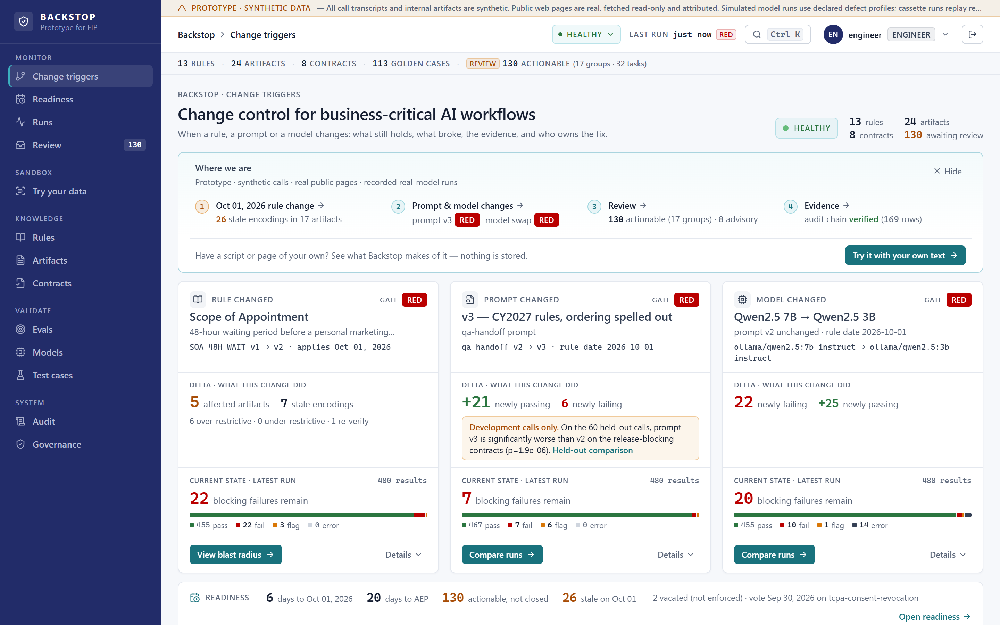
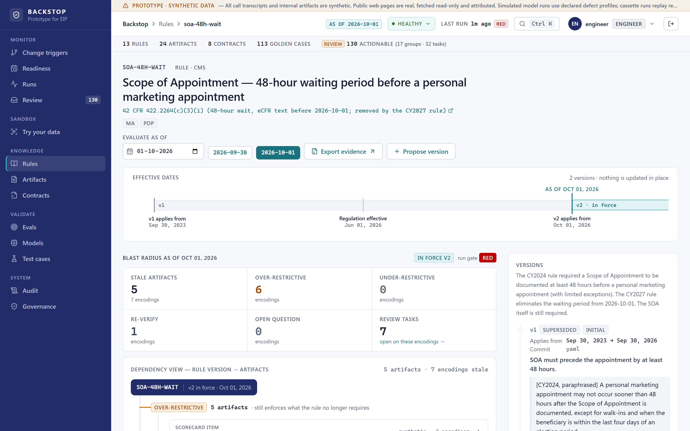
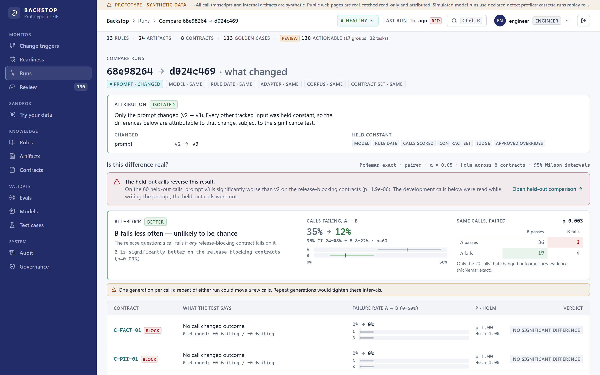
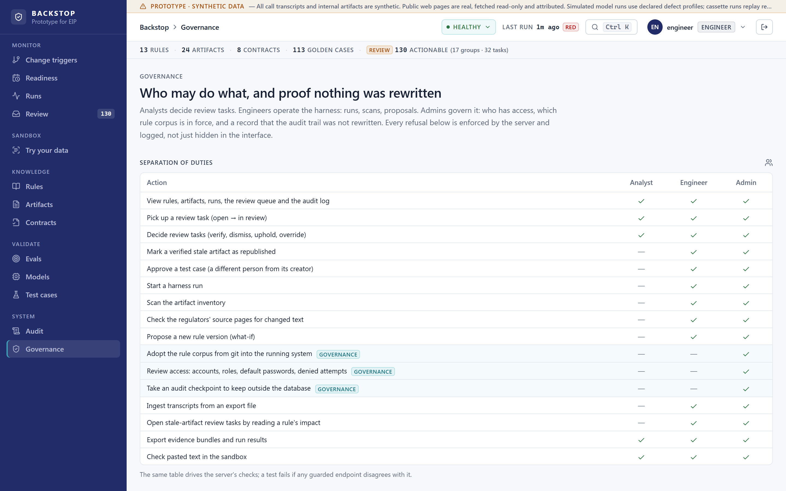

# Backstop

**Change control and regression testing for business-critical AI workflows.**

[](https://github.com/ghantapavan93/EIP-Proto/actions/workflows/ci.yml)


A rule changes. A prompt changes. A model changes. Backstop answers:

- **What changed?**
- **What stayed constant?**
- **What broke?**
- **What evidence proves it?**
- **Who owns the next decision?**



## Why I built this

The question behind it: *how do you know an AI workflow still behaves correctly after
the business rule, the prompt or the underlying model changes?*

A Medicare sales floor now runs on AI: call scoring, coaching notes, QA hand-offs,
scripts, prompts and web pages that all encode what the rules say. On **1 October 2026**
the CMS CY2027 marketing changes take effect, two weeks before the Annual Enrollment
Period. On that day some of those artifacts stop being right, and nothing breaks
loudly: every API stays green while the output quietly goes wrong. The same happens
when someone edits a prompt, or when a vendor swaps the model behind an endpoint.

I built Backstop in about 48 hours as a falsifiable prototype rather than assume the
problem was already solved, and as a working answer to a question from Elite Insurance
Partners about whether I work on the full stack or on AI workflows. It is both. It is
not affiliated with or endorsed by EIP, and every call transcript and internal artifact
in it is synthetic.

## What it does

- **Keeps rules as code.** Thirteen Medicare, TCPA and state rules as versioned,
  effective-dated YAML with citations. History is appended, never edited.
- **Finds what encodes each rule.** Deterministic matchers bind scripts, scorecard
  items, prompts and public pages to the exact rule version they encode, and show which
  go stale on a given date and in which direction.
- **Tests the AI workflow against contracts.** Eight behavioural contracts check every
  model output: schema, verbatim evidence, invented figures, PII and rule judgments.
  A deterministic gate decides release; a model-as-judge is advisory only.
- **Attributes every change.** Comparisons say whether exactly one thing changed, test
  the difference with exact paired statistics, and check it against held-out calls.
- **Puts a person on every decision.** Review tasks, overrides that need a second
  approver, roles the server enforces, and a hash-chained audit log with checkpoints.

## A result that changed my conclusion

I ran the same synthetic calls through three local models (Qwen2.5 7B and 3B, Llama 3.1
8B) at no cost and recorded every output, so every number here replays offline.

Prompt v3 rewrote one line of prompt v2 to fix the 7B's disclaimer judgments.

| Wrong disclaimer judgments (Qwen2.5 7B) | Prompt v2 | Prompt v3 |
|---|---|---|
| 60 development calls (read while writing v3) | 20 | **5** |
| 60 held-out calls (never read) | 5 | **22**, plus 2 schema failures |

On the development calls v3 looked like a fix. On unseen calls it was significantly
worse (p = 1.9 × 10⁻⁶). **The evidence does not establish v3 as better, and neither
prompt earns deployment on it.** The result stays in the repository, is shown above the
development result wherever the two are compared, and is pinned by a regression test
(`test_held_out_replay_reverses_the_prompt_fix`).

Two more findings from the same runs:

- **Correct extraction, wrong conclusion.** The 7B read the disclaimer at 25 s and the
  benefits at 131 s, then called the call non-compliant. The deterministic contract
  caught what the model's own explanation did not.
- **Grounding failures differ by model.** The 3B quoted a timestamp as evidence; the 8B
  returned the JSON schema instead of an answer 12 times.

The full numbers, and which demo acts are simulated by construction, are in the
[reviewer FAQ](docs/reviewer-faq.md).

## A look inside

| Blast radius of a rule change | A comparison that checks itself |
|---|---|
|  |  |
| On 1 October the 48-hour Scope of Appointment wait ends. Every artifact that still enforces it is listed, with the sentence, the direction and the owner. | Only the prompt changed, so the difference is attributable to it. The held-out calls reverse the result, so the page says that first. |



Roles are enforced by the server: analysts decide, engineers operate, admins govern.
The permission table on this page is the one a test checks against every guarded
endpoint.

## How it works


One engine handles all three triggers:

| Trigger | What changes | What stays fixed |
|---|---|---|
| Rule | the rule date crosses an effective date | prompt, model, calls |
| Prompt | the prompt version | rule date, model, calls |
| Model | the model, or how it is called | prompt, rule date, calls |

The boundary for AI is explicit:

| Decision | Made by |
|---|---|
| Which rule version is in force, staleness, task state, deduplication | Deterministic code |
| Whether an artifact encodes a rule | Matchers; a model may *propose* with an exact span, and a person confirms |
| The workflow's extraction and summary | The model under test |
| Whether that output is acceptable | Deterministic contracts against ground truth and the rule in force |
| Coaching-note quality | A model judge: advisory only, five samples, variance shown |
| Editing any rule, artifact or record | Never automated |

The reasoning behind each choice is in the [architecture decision records](docs/adr/)
and the [architecture overview](docs/architecture.md).

## Stack

| Layer | Technology |
|---|---|
| Console | React 18, TypeScript, Vite, Tailwind, TanStack Query |
| API | Python 3.12, FastAPI, SQLAlchemy, Pydantic, Alembic |
| Database | PostgreSQL (SQLite for tests and local runs) |
| Gateway | nginx with strict security headers |
| Models | Ollama locally; any OpenAI-compatible provider; recorded runs for replay |
| Deployment | Docker Compose; Terraform sketch for ECS and RDS |
| Demo access | Cloudflare Tunnel in front of the gateway only |
| CI | GitHub Actions: lint, tests on SQLite and PostgreSQL, the contract gate |

## What is real, and what is not

| | |
|---|---|
| Rules and citations | Real; checked against eCFR and the Federal Register |
| Six public web pages | Real, read once on 2026-09-21; kept as short attributed excerpts |
| Model outputs in the measured results | Real, recorded from local models |
| Call transcripts and internal artifacts | Synthetic, and labelled as such everywhere |
| Rule-flip and model-swap acts | Simulated by construction, and labelled on screen |
| Attention, Salesforce, SFMC and dialer integrations | Not built |

Known limitations and corrections are on the [honesty page](docs/honesty.md).

## Run it

**Docker** (PostgreSQL, API and console):

```bash
docker compose up --build
```

Open http://localhost:5173 and sign in as `analyst`, `engineer` or `admin` (the password
is the username; local use only). The API seeds everything and replays the recorded
runs, so the demo needs no network, GPU or API key. API docs are at
http://localhost:8000/docs.

**Without Docker** (SQLite), from the repository root:

```bash
python -m venv backend/.venv
backend/.venv/bin/pip install -c backend/requirements.lock -e "./backend[dev]"   # Windows: backend\.venv\Scripts\pip
backend/.venv/bin/python -m backstop.cli demo
backend/.venv/bin/python -m backstop.cli serve
cd frontend && npm install && npm run dev              # in a second terminal
```

**Checks** (the same ones CI runs):

```bash
backend/.venv/bin/python -m pytest backend/tests -q
backend/.venv/bin/python -m ruff check backend/backstop backend/tests
backend/.venv/bin/python -m mypy --config-file backend/pyproject.toml backend/backstop
cd frontend && npm run lint && npm run test -- --run && npm run build
```

There are 348 backend tests, run on SQLite and PostgreSQL, and 246 frontend tests; the backend is type-checked with mypy. The
release gate is a command a pipeline can run:
`backstop run --prompt 2 --model sim-large --rule-date 2026-10-01 --gate` exits 0 only
when every blocking contract passes.

See [CONTRIBUTING.md](CONTRIBUTING.md) for the development workflow and
[docs/operations.md](docs/operations.md) for publishing a demo.

## Repository layout

```
.
├── rules/              Rule corpus: one YAML file per rule, versioned and effective-dated
├── contracts/          The behavioural contracts every workflow output must satisfy
├── fixtures/           Artifact inventory, page excerpts, golden sets, recorded model output
├── backend/
│   ├── backstop/
│   │   ├── api/        HTTP routers, one per resource
│   │   ├── core/       Domain logic: rules, staleness, review, audit, evidence, statistics
│   │   ├── harness/    The workflow under test, model adapters, contracts, runner
│   │   └── scanner/    Crawler, matchers, source watcher
│   ├── alembic/        Database migrations
│   └── tests/
├── frontend/
│   └── src/
│       ├── api/        Typed client and data hooks
│       ├── components/ Grouped by feature: layout, ui, charts, runs, rules, evidence, …
│       ├── pages/      One component per route
│       ├── lib/        Pure view logic
│       └── test/
├── infra/terraform/    The production shape as code (ECS, RDS, scheduled task), not applied
├── scripts/            Demo bring-up, tunnel, keep-alive and preflight
└── docs/               Decisions, ADRs, honesty ledger, API contract, operations
```

Each top-level folder has its own README.

## How I built it

AI tools accelerated the research and much of the implementation. I owned the problem
selection, the architecture boundaries, the scope, the evaluation design, the
trade-offs, and the decision to keep negative results such as the held-out regression.
What the AI got wrong and how it was caught is in
[docs/ai-build-ledger.md](docs/ai-build-ledger.md); the decisions are in
[docs/decisions.md](docs/decisions.md).

## Documentation

| If you want | Read |
|---|---|
| The decisions I made, and why | [docs/decisions.md](docs/decisions.md) |
| Answers to the hard questions | [docs/reviewer-faq.md](docs/reviewer-faq.md) |
| What is real, and the known limitations | [docs/honesty.md](docs/honesty.md) |
| How the system fits together | [docs/architecture.md](docs/architecture.md), [docs/adr/](docs/adr/) |
| The API | [docs/api-contract.md](docs/api-contract.md) |
| Security and the threat model | [SECURITY.md](SECURITY.md), [docs/threat-model.md](docs/threat-model.md) |
| What I would ask before building further | [docs/open-questions.md](docs/open-questions.md) |

## What I would do next

A pre-review audit found a few things I chose to disclose rather than change late,
because each one moves recorded numbers: fingerprint generation settings into a run's
identity, scope rules by product, channel and jurisdiction, widen the PII contract to
every output field, add a dry run to ingest, and move long model runs to a worker. The
list and the reasons are on the
[honesty page](docs/honesty.md#found-in-the-pre-review-audit-2026-09-25-deliberately-not-changed-yet).

## License

Copyright © 2026 Pavan Kalyan. All rights reserved; shared for evaluation. See
[LICENSE](LICENSE). The public pages under `fixtures/` are short attributed excerpts
and remain their owners' property.
